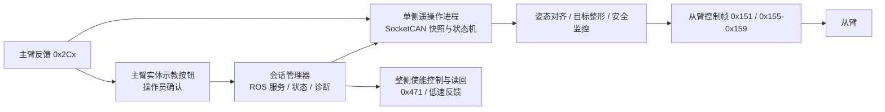

# 两 CAN 主从臂遥操作的技术实现

本文记录“手动进入主臂实体示教 → 主从姿态自动对齐 → 主从遥操作 → 停止遥操作 → 从臂返回本轮起始姿态 → 手动退出实体示教 → 主从臂失能”流程的实现架构、状态转换、数据通路和安全约束。它描述软件如何协作完成该流程，不是现场操作步骤。系统背景、CAN 协议依据、变更历史和详细测试记录见[两 CAN 上位机实现方案](TWO_CAN_HOST_TELEOP_IMPLEMENTATION.md)；现场使用说明见[Piper 遥操作说明](PIPER_TELEOP.md)。

## 1. 系统边界与拓扑

每侧主臂与从臂接入同一条 SocketCAN 总线。主臂通过离线偏移配置使用 `0x2Cx` 反馈和 `0x15x` 控制地址；从臂使用默认地址。控制进程通过同一 CAN 接口直接接收和发送帧。ROS 2 用于会话管理、状态和诊断，不在逐周期运动数据路径中。



一个物理总线上的 `0x471` 使能/失能帧是广播语义；低速使能反馈也不能可靠区分同总线上主、从臂。因此软件把它作为“整侧”动作与读回处理，不假设可以仅使能或仅失能其中一台。`0x470` 会改写偏移配置，不属于运行期控制路径。

## 2. 模块职责

| 模块 | 职责与边界 |
| --- | --- |
| `piper_two_can_teleop.py` | 单侧会话状态机、SocketCAN 收发、主从快照、对齐后衔接、目标滤波/限速、故障停流。实时控制由该进程直接完成。 |
| `piper_two_can_align.py` | 独立单侧对齐器；支持主从姿态对齐以及以固定关节角为目标的从臂回位。执行前规划目标、限位和轨迹，执行期间监控反馈与安全条件。 |
| `piper_two_can_identity.py` | 只读验证总线身份、地址分离、反馈完整性和频率等前置条件。 |
| `piper_two_can_manager.py` | ROS 管理层，协调单侧/双侧启动、实体示教确认、停止、释放确认、状态与诊断；不承担每帧转发。 |
| `piper_arm_enable.py` | 整侧 `0x471` 使能/失能帧与低速反馈读回。 |
| `piper_master_state.py`、`piper_feedback.py` | 复用主臂偏移反馈解码、单位换算、限位及滤波等基础逻辑。 |

当前回位由独立对齐器完成，管理器和遥操作会话尚未提供一个贯穿停止、回位、实体示教退出、失能读回的统一 `RETURNING` 会话接口。因此整体工作流是由会话状态机、回位组件和整侧使能组件组合实现；这是现状，不应误认为已经有单进程自动编排。

## 3. 状态与转换

单侧遥操作会话的主要状态为：

```text
OFFLINE → IDLE_DISABLED → ARMING → WAIT_TEACH → ALIGNING → ACTIVE
                                                    ACTIVE → STOPPING
  WAIT_TEACH_RELEASE ← STOPPING → IDLE_DISABLED
  故障或门禁失败 → FAULT_LATCHED
```

`ARMING` 表示发出整侧使能请求并等待读回；`WAIT_TEACH` 等待操作员通过主臂实体按钮进入示教并作软件确认；`ALIGNING` 完成新鲜状态采样、规划、自动对齐和末端验证；`ACTIVE` 才接受主臂增量并发送从臂目标。`STOPPING` 首先关闭目标流并令从臂待机。停止后是否进入 `WAIT_TEACH_RELEASE` 取决于是否需要保留使能以执行回位；最终实体示教退出确认后，才允许整侧失能并验证 `IDLE_DISABLED`。

任何故障锁存均禁止自动回到 `ACTIVE`。恢复需要结束本轮目标流、处理故障条件并重新经过启动和示教确认链。物理按钮的状态由操作员确认；总线模式字节不能替代实体示教按钮状态的确认。

回位在当前实现中是状态机外的一段组合过程：停止会话并保留使能 → 以固定记录角度运行回位轨迹 → 从臂待机 → 操作员退出主臂实体示教 → 整侧失能并读回。回位目标是本轮记录的从臂起始六关节角，不是机械零位或笛卡尔空间 Home。

## 4. 反馈快照与实时控制通路

主从臂六关节角度分别由三组高速反馈帧组装：主臂 `0x2C5`～`0x2C7`，从臂 `0x2A5`～`0x2A7`。每组帧的关节原始量以 `0.001°` 解码为角度。只有三帧均新鲜且满足最大时间偏差约束时才形成有效快照；默认过期阈值为 `30 ms`、组内最大时间偏差为 `10 ms`。新快照带有代次标识，控制循环对同一主臂代次最多生成一次新目标，避免高频循环重复消费旧样本。

低速帧 `0x261`～`0x266` 用于观察关节使能状态。它们用于判断整侧是否一致使能/失能，不作为逐周期位置反馈。使能请求后等待启动稳定时间，再在采样窗口核实六关节状态；“帧发送成功”不等于“动作已生效”。

主臂新快照经过身份/新鲜度校验、限位检查、滤波与速率限制后，编码成从臂控制帧：关节控制 `0x151`、`0x155`～`0x157`，夹爪控制可用 `0x159`。遥操作不向主臂发送运动控制帧，也不在运行时改变地址偏移。ROS 管理消息与状态发布不承载关节目标流。

## 5. 示教后的姿态对齐

实体示教确认后，软件重新采样主从姿态，而不是复用启动前的读数。对每关节以主臂当前角度为目标、从臂当前角度为起点，先验证目标关节范围、整侧使能、反馈新鲜度、主臂稳定性和总线健康，再构造平滑轨迹。规划默认拒绝超过 `30°` 的初始差值；目标限位修正最多 `1°`。轨迹使用五次 minimum-jerk 曲线：

```text
s(u) = 10u³ - 15u⁴ + 6u⁵,  u ∈ [0, 1]
q(u) = q_start + (q_goal - q_start) · s(u)
```

时长由最短时长和峰值速度约束共同确定，默认最短 `2 s`、峰值速度 `5°/s`。曲线峰值速度系数为 `1.875`，因此规划时长至少为 `1.875 × 最大关节位移 / 峰值速度`。运动期间检查主臂漂移、从臂跟踪误差、反馈超时、使能变化、关节边界和总线错误；例如主臂漂移容差为 `0.5°`、对齐跟踪误差容差为 `3°`。完成后还需末端角度误差在容差内，并通过静止探测确认无持续变化，才允许转入 `ACTIVE`。

回位复用平滑固定目标轨迹，但目标来自本轮保存的从臂起始角，而非实时主臂角；回位期间关闭主臂跟随。回位仍需新鲜主从反馈作为运行安全监视输入，并遵守限位、使能、总线健康、终点误差和待机约束。

## 6. ACTIVE 跟随与退出

ACTIVE 阶段每个有效主臂快照生成对应关节目标。目标链包含死区、滤波（alpha-beta 与后续平滑链）和速率约束，随后以配置的控制频率发送。默认控制频率为 `200 Hz`；当前现场已验收的是 `50 Hz`。默认速度百分比为 `100%`，对齐使用单独的低速规划值。夹爪控制可关闭；其零点或映射未经现场验证时不应把它视作已验收功能。

会话持续监控主臂/从臂反馈、使能样本、CAN 错误状态和外部控制帧。跟随误差超过 `10°` 持续 `1 s` 会触发停止；可恢复类错误采用默认 `5 s` 滚动窗口和 `20 Hz` 频率阈值评估，bus-off、error-passive、总线错误以及检测到的外部控制流会直接进入故障处理。完整错误分类以实现和方案记录为准。

结束请求或超时后停止生成新目标，并发送从臂标准待机控制。软件不借用主臂模式切换帧模拟实体退出。若需要回位，停止阶段保留整侧使能并由外层启动固定目标回位；若不回位则可走实体示教释放确认和失能流程。最终失能必须由实体示教已退出的操作员确认触发，然后发送整侧失能帧并检查窗口内样本全部为 disabled；混合、缺样或仍 enabled 都不能报告成功。

## 7. 安全不变量与故障策略

- 只有身份、反馈完整性、整侧使能读回、实体示教确认、关节限位和总线健康都满足，才允许进入自动运动状态。
- 任何位置目标须落在关节指令限位内；程序拒绝异常姿态或过大差值，不通过放宽限位绕过规划失败。
- 运动期间失去新鲜反馈、主臂显著漂移、跟踪误差持续超限、使能异常、外部控制帧或严重 CAN 故障，均停止目标流并令从臂待机；不能自动续跑。
- `0x470` 仅属离线配置用途。运行期不得发送；`0x170`/`0x171` 不替代实体按钮退出；`0x471` 是整侧广播，任何使能/失能都必须结合低速反馈读回判断结果。
- 失能可能使机械臂受重力影响。软件状态机只保证协议动作与读回次序，不能检测人员是否托稳、空间是否清空，相关物理条件需由现场流程建立。

## 8. 当前实现与验证边界

已有实现覆盖单侧身份检查、minimum-jerk 对齐、ACTIVE 关节跟随、停止待机、独立固定姿态回位、实体示教释放确认和整侧使能状态读回。左侧已记录 `50 Hz`、约 `30 s` 的关节跟随现场验证，反馈约 `199`～`201 Hz`，并完成对齐与从臂返回起始关节角的流程。该证据不等于已验证默认 `200 Hz` 控制、端到端延迟、夹爪镜像或右侧真机运行；瞬时最大跟随误差与现场感觉也不能单独作为安全证明。

现有记录还显示失能后的某次读数中 J3 为 `2.216°`，略超当前指令上界 `2°`。后续规划遇到越界应按异常姿态处理并重新校正，不扩大限位。测试数据、具体参数来源和软件修复记录保存在[实现方案第 15～17 节](TWO_CAN_HOST_TELEOP_IMPLEMENTATION.md)。

若要将组合流程收敛为单一会话接口，下一步实现应把回位作为显式 `RETURNING` 状态纳入遥操作会话/管理器：在停止时冻结并持久保存从臂起始快照；回位成功后要求新的实体示教释放确认；最后完成整侧失能读回并发布终态。回位失败则保持目标流关闭、保持状态可诊断，并禁止误报流程完成。还需为每个阶段定义请求幂等性、超时、取消行为和故障恢复路径，避免 ROS 管理层与独立回位进程同时争用同一 CAN 总线。
